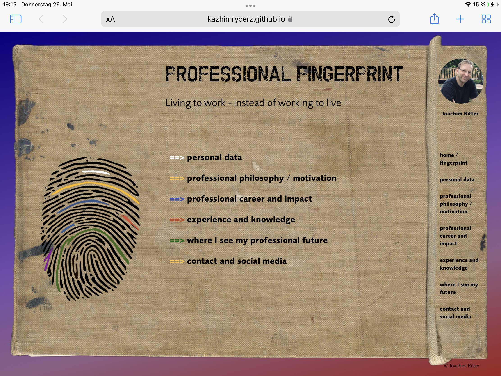

# Joachim Ritter
personal website
Journalist, manager, creator of opportunities, currently learning website coding.

### Working plan

- [x] basic set-up working tree and working plan
- [x] personal data
- [ ] professional philosophy / motivation
- [ ] professional career / influence in the professional world
- [ ] experience and knowledge
- [ ] where I see my future
- [ ] contact and social media

### How to use this project

--> information only - presentation

### Contact

E-Mail: [jritter@via-internet.com] <mailto:jritter@via-internet.com>
GitHub: [Joachim Ritter](https://github.com/KazhimRycerz)
LinkedIn: [Joachim Ritter](https://www.linkedin.com/in/joachimr/)
Xing: [Joachim Ritter](https://www.xing.com/profile/Joachim_Ritter19/)
Instagram: [Joachim Ritter](https://www.instagram.com/ritter_joachim/)

---
#### Developed With

- [x] _HTML5_
- [x] _CSS3_
- [x] _SASS_
- [ ] _SCSS_
- [x] _JavaScript_
- [ ] _React_
- [ ] _Bootstrap_
- [x] _npm_
- [ ] _..._

#### Used Tools in my Life

- creativity
- experience
- knowledge
- curiosity
- openness

### Used tools for my website
- [ ] [ionicons](https:ionicons.com//)
- [ ] [Canva](https://www.canva.com/)
- [x] [npm](https://www.npmjs.com/)
- [ ] [Google Fonts](https://fonts.google.com/)
- [x] [Visual Studio Code](https://code.visualstudio.com/)
- [ ] [ColorZilla](https://www.colorzilla.com/chrome/)
- [x] [Font-Awesome](https://fontawesome.com/)

---

© Joachim Ritter